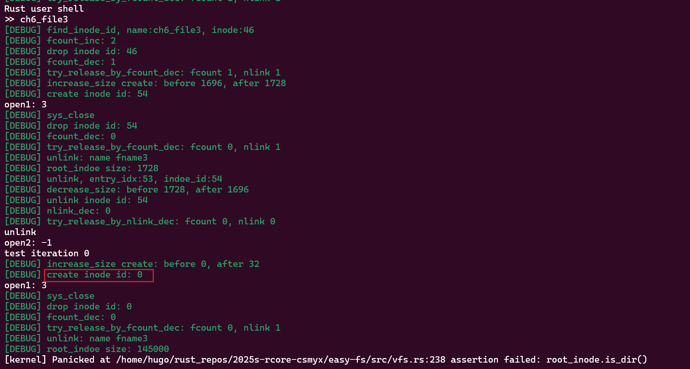

### 

#### linkat
我理解linkat创建硬链接的过程等于是复制一个已经打开的的文件inode。

当使用 link 系统调用（或 linkat）时，不会创建新的文件数据，而是 在文件系统中新增一个目录项（dentry），指向 同一个 inode。

1. 首先根据old_name找到原始的inode: old_name -> inode

2. 然后复制inode_id，创建一个新的dir_entry：(new_name, inode)
dir_entry其实就是写inode_block

3. 需要增加inode的nlink
在diskinode中添加nlink字段，

需要考虑，如果直接增加该字段的话，这会导致diskinode的大小发生变化，
而原始diskinode的大小是128字节，和块大小512字节对齐，inodes_per_block=4
加了之后，导致inodes_per_block=3，且存在块内碎片

所以我们的策略是，增加nlink字段之后，把将direct直接索引数减一，这样还是保持diskinode大小为128字节，只是最大文件大小减小了一点，影响不大。

4. 修复了一个bug，bug表现出来时：open_file时create的inode的inode id，和link查找到的inode id不同，导致访问到的block不正确，nlink始终显示为0
   
原因：`inode::inode_id()`实现有问题，没有考虑到inode id的起始block偏移（inode_area_start_block），导致link查找inode的block时，到了错误的block，从而导致数据错误。

修复方案：详见commit，（改了两次，第一次改了还是有问题，第二次是gpt生成的，完全没问题，蚌）


#### unlink

以下注意事项摘自llm：

链接与文件删除：若文件存在多个硬链接，unlink 只会移除指定的链接，只有当所有硬链接都被移除，且没有进程打开该文件时，文件才会被真正删除。

文件打开状态：若有进程正在打开该文件，即使使用 unlink 移除了所有链接，文件的数据块也不会被释放，直到所有打开该文件的进程都关闭了文件描述符。

权限问题：要删除文件，调用进程需要对包含该文件的目录有写权限，并且对该文件本身有写权限（在某些系统上）。

##### questions

1. nlink 如果减到0，需要释放inode，如何释放inode呢？
   我开始理解只要释放inode_id，同时将fd_table中的fd释放就好了吧
   但是实际上，如果nlink减到0，还有进程正在打开该文件（即用户还有已经打开的fd），此时不能删除，必须等到所有进程都释放掉fd之后，才能删除。

   inode结构和实际的DiskInode之间的关系是解耦的，或者说，inode只是一个指向DiskInode的指针。
释放DiskInode的数据（或者说释放inode_id）不会导致inode数据无效，只有当真正使用inode去访问数据时，才能知道对应的DiskInode是否已经被释放。

   对应到实际实现上，
   1. 如果nlink减到0时，且此时无进程的fd_table持有Arc<OSInode>，则此时直接释放
   2. 如果nlink减到0时，存在持有，则延迟到最后一个fd_table持有的Arc<OSInode>计数减到0时，查看nilnk如果等于0，此时才释放。
   
   那当nlink减到0时，该如何检测是否还有进程持有Arc<OSInode>呢？

以下内容来自DeepSeek：
```
一、内核如何检测是否有进程仍在使用文件？
1. 核心数据结构
struct file（文件表项）：

每个打开的文件对应一个 struct file 实例，记录文件的 读写偏移量、访问模式、引用计数（f_count） 等。

f_count：表示当前有多少个文件描述符（可能跨进程）指向该 struct file。

存储在 系统级文件表（全局内核数据结构）中。

struct inode（索引节点）：

存储文件的元数据（权限、大小、时间戳等）和数据块指针。

i_count：表示当前有多少个 struct file 或硬链接指向该 inode。

i_nlink：硬链接数（即有多少个目录项指向该 inode）。

2. 引用计数的关联
打开文件时：

c
fd = open("file.txt", O_RDONLY); // 内核操作：
  1. 根据路径找到文件的 inode。
  2. 创建一个新的 `struct file` 实例，初始化其 `f_count = 1`。
  3. 将进程的文件描述符表中某个空闲项指向该 `struct file`。
  4. 增加 inode 的引用计数：`inode->i_count++`。
关闭文件时：

c
close(fd); // 内核操作：
  1. 减少 `struct file` 的 `f_count--`。
  2. 若 `f_count == 0`，释放该 `struct file`。
  3. 减少 inode 的 `i_count--`。
  4. 检查 `i_count == 0 && i_nlink == 0`，若成立则释放 inode 和数据块。
3. 检测逻辑
内核通过 inode->i_count 判断是否有进程在使用文件：

i_count > 0：表示至少有一个 struct file（即某个进程的文件描述符）引用该 inode。

i_count == 0：表示没有进程持有该文件的打开实例。

i_nlink（硬链接数）：

由 unlink() 或 rm 命令减少，当 i_nlink == 0 且 i_count == 0 时，inode 和数据块被释放。

二、进程关闭文件时，如何知道是否还有其他打开的文件描述符？
1. 关闭文件的流程
当进程调用 close(fd) 时，内核执行以下操作：

减少 struct file 的引用计数：

通过文件描述符找到对应的 struct file，执行 f_count--。

若 f_count > 0：表示其他文件描述符（可能是本进程或其他进程的）仍在使用该 struct file，无需释放资源。

若 f_count == 0：释放 struct file 的内存，并调用 iput(inode) 减少 inode 的引用计数。

减少 inode 的引用计数：

执行 inode->i_count--。

检查 i_count == 0 && i_nlink == 0，若成立则触发 inode 和数据块的释放。

2. 多进程共享文件描述符的场景
示例 1：fork() 创建子进程：

c
int fd = open("file.txt", O_RDONLY);
pid_t pid = fork();

if (pid == 0) { // 子进程
    read(fd, buf, 100);
    close(fd);  // 子进程关闭，`f_count--`（从 2 → 1）
} else {        // 父进程
    sleep(1);
    close(fd);  // 父进程关闭，`f_count--`（从 1 → 0），释放 `struct file`
}
初始 f_count = 2（父子进程各一个文件描述符）。

子进程关闭后，f_count = 1，父进程关闭后 f_count = 0，触发资源释放。

示例 2：dup() 复制文件描述符：

c
int fd1 = open("file.txt", O_RDONLY);
int fd2 = dup(fd1);  // `f_count` 从 1 → 2

close(fd1); // `f_count--`（2 → 1）
close(fd2); // `f_count--`（1 → 0），释放 `struct file`
三、关键机制总结
操作	对引用计数的影响	资源释放条件
open()	f_count++, i_count++	-
close()	f_count-- → 若为 0 则 i_count--	f_count == 0 时释放 struct file
unlink()	i_nlink--	i_nlink == 0 且 i_count == 0 时释放 inode
四、观察引用计数的方法
1. 查看进程的文件描述符
bash
ls -l /proc/<PID>/fd   # 查看进程打开的文件描述符
2. 查看 inode 信息
bash
stat file.txt          # 查看文件的硬链接数（i_nlink）
3. 内核调试工具
使用 crash 或 systemtap 直接查看内核中的 struct file 和 struct inode 的引用计数（需高级权限）。

五、总结
内核通过 struct file 的 f_count 和 struct inode 的 i_count 跟踪资源使用。

文件关闭时：减少 f_count，若归零则释放 struct file 并减少 i_count。

inode 释放条件：i_count == 0（无进程使用）且 i_nlink == 0（无硬链接）。
```
这里提到了三个计数：
映射关系：

i_count: 简单来说，只要创建fd和inode关联时就自增，包括open，close

- sys_open: 
    分完两种情况：
    1. open的文件还未创建，会初始化一个inode，此时不需要自增，因为初始化时fcount为1，
    2. open的文件已经创建，即已经初始化过了，此时需要自增fount
- sys_close
    --fcount，如果fount==0的话检测是否nlink也为0，则释放inode

i_nlink: 包括open(仅限实际执行了create操作的open)，link，unlink

##### bug


#### fstat
##### questions
    1. 如何根据fd文件描述符获取其对应的inode？
   
    fd_table中存的是`dyn File`的trait对象，目前其实际对象包括：stdin、stdout和OSInode。只有OSInode存在inode，stdin和stdout都没有inode，所以应该需要获取到该trait对象的原始对象。当原始对象不是OSInode时，返回-1。

    那么问题来了，如何将`trait object`转换成原始类型呢？貌似直接导入`core::any::Any`，然后就可以强制转换成`&dyn Any`就可以了。但是根据https://stackoverflow.com/questions/33687447/how-to-get-a-reference-to-a-concrete-type-from-a-trait-object。我们需要需要给File实现Any trait，同时还需要实现一个自定义的as_any方法。
    
    折腾到最后才发现，过于复杂了，既然反正都要修改File trait的定义了，为啥不直接在File trait里添加能否直接返回state的接口呢？仔细想了想，这才是正确的设计思路。因为，state是File的属性，就应该是在File里面存在公共的访问接口，然后各个具体的类型给出自己实现。不应该还需要使用者自己去downcasting到具体的类型才能获取到state。

    2. 但是我们只能通过OSInode获取到inode的内容，却无法获取到inode number，如何解决？

    我觉得最直接的方式是实现`get_diskinode_pos`的逆过程
